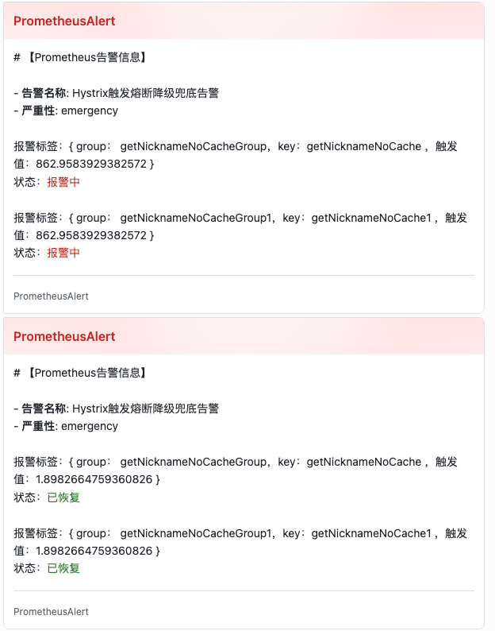

# hystrix-cache-starter


[Hystrix](https://github.com/Netflix/Hystrix) 是一款优秀的服务容错与保护组件，能够有效地阻止分布式微服务系统中出现联动故障,Hystrix提供了服务降级、服务熔断、线程隔离、请求缓存、请求合并以及实时故障监控等强大功能。

但是实际使用中，仍然有一些需求没有实现：
 * **缺乏基于本地缓存/二级缓存的服务降级机制**：目前使用都是返回固定的降级兜底数据，无法满足例如在feed流场景下，异常情况下若无兜底数据，极易造成feed流白屏或数据异常情况

 * **请求缓存能力弱**：官方提供的请求缓存功能较为简单（个人觉得很鸡肋），不支持多次请求公用同一个缓存

 * **动态调参不能结合配置中心**：官方提供的动态配置中心：[archaius](https://github.com/Netflix/archaius)，难以在分布式场景下使用
 * **监控指标协议**：官方提供的监控指标在分布式场景下需要[Turbine](https://github.com/Netflix/Turbine)中间聚合监控指标，且不是Prometheus协议，而[hystrix-prometheus](https://github.com/ahus1/prometheus-hystrix)提供了Prometheus协议的指标，但是对业务代码侵入性较高，各个服务都需要引用

hystrix-cache-starter中间件提供了解决这些问题的方案

hystrix-cache-starter环境：
* JDK 21
* SpringBoot 3.2.3
* [JetCache](https://github.com/alibaba/jetcache/wiki/)
* Hystrix 1.5.18

# 0、快速开始
## 0.1 引入依赖
```xml
        <dependency>
            <groupId>io.github.xx-ee</groupId>
            <artifactId>hystrix-cache-starter</artifactId>
            <version>1.0.5</version>
        </dependency>
```
## 0.2 启动配置
```java
@SpringBootApplication

@EnableHystrixCmd  // 启用hystrix-cache注解
@EnableMethodCache(basePackages = "xxd.**") // 使用jetcache
@EnableCreateCacheAnnotation // deprecated in jetcache 2.7, can be removed if @CreateCache is not used
public class HystrixAppApplication {

    public static void main(String[] args) {
        SpringApplication.run(HystrixAppApplication.class, args);
    }

}
```
## 0.2 application.yml配置
```yaml
jetcache:
  statIntervalMinutes: 15
  areaInCacheName: false
  local:
    default:
      type: caffeine #other choose：caffeine
      keyConvertor: fastjson #other choose：fastjson/jackson
      limit: 100
#  remote:
#    default:
#      type: redis
#      keyConvertor: fastjson2 #other choose：fastjson/jackson
#      broadcastChannel: projectA
#      valueEncoder: java #other choose：kryo/kryo5
#      valueDecoder: java #other choose：kryo/kryo5
#      poolConfig:
#        minIdle: 5
#        maxIdle: 20
#        maxTotal: 50
#      host: ${redis.host}

management:
  endpoints:
    web:
      exposure:
        include: 'prometheus'
  endpoint:
    prometheus:
      enabled: true
  server:
    port: 9010


```

# 1、基于本地缓存/二级缓存的服务降级机制
## 1.1 背景
hystrix提供的降级机制，只能写死固定的返回，或者需要特殊定制返回特定的返回值，对业务代码的侵入性很大。而基于缓存的降级机制，可以在触发熔断降级时，该中间件可以做到返回熔断前最后一次请求成功的兜底数据，尽最大可能保证服务的可用性，对业务代码侵入性极小。例如在Feed流的场景下，如果服务异常，Feed流极容易导致白屏不可用。
## 1.2 实现方式
自定义注解@HystrixCmd+AOP+[JetCache](https://github.com/alibaba/jetcache/wiki/)缓存框架
* 兜底数据记录/更新时机：每次请求外部接口成功后进行记录
* 兜底数据缓存时长：24h，可配置化，可容忍依赖服务的最大崩溃时长
* 兜底数据启用时机：熔断降级时启用
## 1.3 使用

```java
 @HystrixCmd(
         //与hystrix groupKey一致
        groupKey = "getNicknameGroup",
        //与hystrix commandKey 一致
        commandKey = "getNickname",
        //与hystrix threadPoolKey 一致
        threadPoolKey = "getNicknameThreadPool",
        // 兜底缓存数据使用的key，使用SpEL表达式
        cacheKey = "#userId",
        // 启用缓存兜底模式
        useCacheAfter = true,
        // 缓存兜底失败时，取的默认返回值
        fallbackDefaultJson = "")
public String getNickname(long userId) {
    String result = restTemplate.getForObject("http://localhost:8090/outer/user/api/nickname/query?userId=" + userId, String.class);
    return result;
}
```
> 以上保证了不同userId请求异常时，返回对应的userId所对应的兜底缓存数据，保证服务的高可用性


# 2、基于本地缓存/二级缓存的缓存优先使用模式
## 2.1、背景
在调用外部接口时，优先使用缓存，若缓存不存在时，调用外部接口，若外部接口调用失败，则返回兜底数据
## 2.2、使用
```java
 @HystrixCmd(
         //与hystrix groupKey一致
        groupKey = "getNicknameGroup",
        //与hystrix commandKey 一致
        commandKey = "getNickname",
        //与hystrix threadPoolKey 一致
        threadPoolKey = "getNicknameThreadPool",
        // 兜底缓存数据使用的key，使用SpEL表达式
        cacheKey = "#userId",
        // 优先使用缓存模式
        useCacheFirst = true,
        // 缓存兜底失败时，取的默认返回值
        fallbackDefaultJson = "")
public String getNickname(long userId) {
    String result = restTemplate.getForObject("http://localhost:8090/outer/user/api/nickname/query?userId=" + userId, String.class);
    return result;
}
```


# 3、jetcache控制台
```text
cache       |       qps|   rate|           get|           hit|          fail|        expire|avgLoadTime|maxLoadTime
------------+----------+-------+--------------+--------------+--------------+--------------+-----------+-----------
hystrixCache|    312.64| 33.62%|       281,363|        94,591|             0|             1|        0.0|          0
------------+----------+-------+--------------+--------------+--------------+--------------+-----------+-----------
```
# 4、prometheus+grafana+alertmanager+feishu告警
## 4.1 grafana

## 4.2 feishu告警

